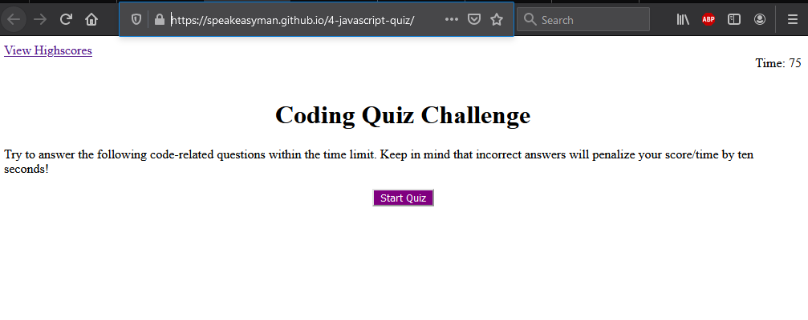
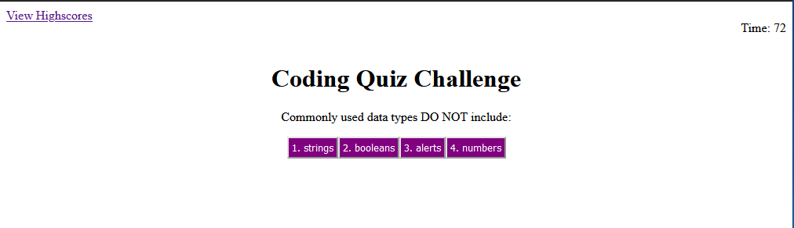
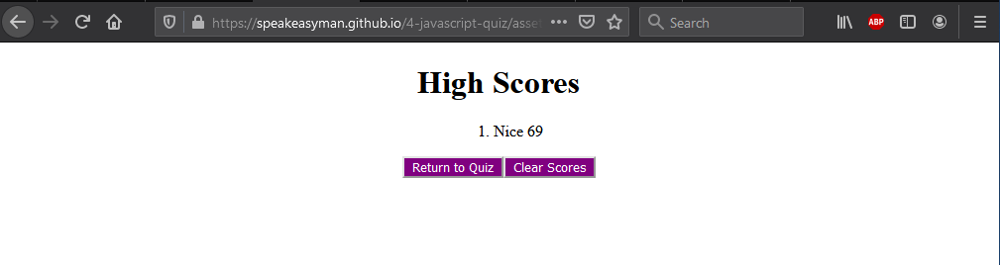

# 4-javascript-quiz
The week four homework assignment for my bootcamp.  
1.0 Title
    Javascript Quiz

2.0 Introduction:
    The goal for this weeks homewor was to create a quiz of given questions and a counter. If the answer was wrong, then 10 seconds would be subtracted from the counter. The end score was the time remaining of the initial 75 seconds. Then, the user should be able to store their initials and score in their browser's local storage and see that on the highscore page.

3.0 Technologies:
    Javascript mainly, there is of course minimally html and css.

4.0 Launch:  
The website is located at: https://speakeasyman.github.io/4-javascript-quiz/

The repo is located at: https://github.com/speakeasyman/4-javascript-quiz

5.0 My goals:
    So, on the main index page all of elements for the quiz is there. Using the event listeners, the elements will have display none or flex through three phases. Phase 1, welcoome screen. Phase 2, where the timer is working, and the questions are generated. Phase 3, the option for you to input your initials before proceeding to the high score page. The high score page will pull the stored high scores (if any), from the browser's local storage and display them.

6.0 In use: 

The page you see when you first open the webpage.  

  

The quiz in action. With four repsonses  

 

The end screen after the quiz has completed

  

The High Score Screen  

